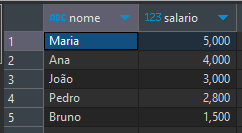
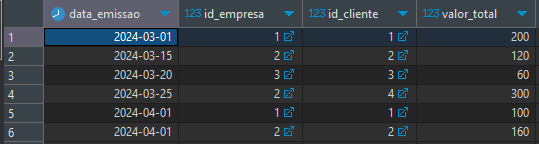
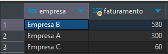
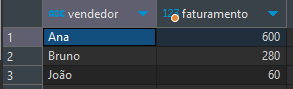
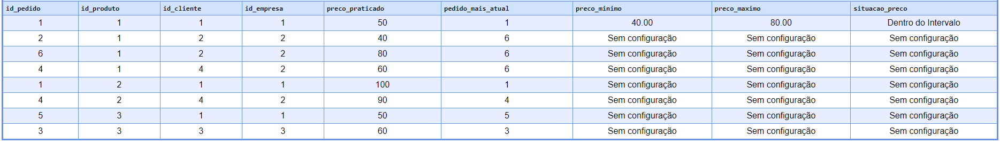

# Teste de SQL Intermediário
## (Última atualização) - 03/04/2024
### Este projeto é a solução de um desafio sobre SQL, para verificar a validade dos códigos desenvolvidos, adicionei uma pequena quantidade de dados simulando um caso real.

## Índice

- [Geral](#geral)
  - [Desafio](#desafio)
  - [Links](#links)
- [Meu Processo](#meu-processo)
  - [Tecnologias](#-tecnologias)
  - [Sobre](#sobre)
  - [Solução](#-solução)
  - [Melhorias](#muscle-melhorias)
- [Autor](#autor)

## Geral

### Desafio
Realizar uma série de tarefas divididas em Consultas Básicas e de Junção. Focar em consultas eficientes e otimizadas, utilizando comentários (se necessário) para uma melhor explicação.

- O banco de dados possui as seguintes tabelas:
    - `EMPRESA (id_empresa, razao_social, inativo)`
    - `PRODUTOS (id_produto, descricao, inativo)`
    - `CONFIG_PRECO_PRODUTO (id_config_preco_produto, id_vendedor, id_empresa, id_produto, preco_minimo, preco_maximo)`
    - `VENDEDORES (id_vendedor, nome, cargo, salario, data_admissao, inativo)`
    - `CLIENTES (id_cliente, razao_social, data_cadastro, id_vendedor, id_empresa, inativo)`
    - `PEDIDO (id_pedido, id_empresa, id_cliente, valor_total, data_emissao, situacao)`
    - `ITENS_PEDIDO (id_item_pedido, id_pedido, id_produto, preco_praticado, quantidade)`

**Consultas Básicas:**

- Escreva consultas SQL para obter as seguintes informações:
    - Lista de funcionários ordenando pelo salário decrescente.
    - Lista de pedidos de vendas ordenado por data de emissão.
    - Valor de faturamento por cliente.
    - Valor de faturamento por empresa.
    - Valor de faturamento por vendedor.

**Consultas de Junção:**

- Escreva consultas SQL para obter as seguintes informações usando junções:
    - Unindo a listagem de produtos com a listagem de clientes, procure o último preço praticado nesse cliente com esse produto, formule o preço base do produto dentro da coluna chamada preco_base no seu select, conforme a seguinte regra:
        - O preço base do produto deve obedecer a configuração de preço da tabela CONFIG_PRECO_PRODUTO.
        - Caso as junções não retornem o último preço praticado, utilize o menor da configuração de preço do produto.
    - Nesta mesma consulta, os seguintes campos deverão estar contidos:
        - Id do produto em questão;
        - Descrição do produto;
        - Id do cliente do pedido;
        - Razão social do cliente;
        - Id da empresa do pedido;
        - Razão social da empresa;
        - Id do vendedor do pedido;
        - Nome do vendedor;
        - Preço mínimo e máximo da configuração de preço;
        - Preço base do produto conforme a regra.

### Links

- Solução: [GitHub Repo](https://github.com/bigodrigo/versotech-sql-challenge)
- Original: [Versotech Desafio SQL](https://github.com/Espitalher/prova-sql-entrevista)
- Segundo Desafio: [Versotech Desafio PHP](https://github.com/bigodrigo/versotech-php-challenge)


## Meu Processo

### 🚀 Tecnologias

- SQL
- [PostgreSQL](https://www.postgresql.org)
- [DBeaver](https://dbeaver.io)

### Sobre

- O projeto possui uma pasta com códigos de criação das tabelas necessárias para a preparação do ambiente, uma pasta com códigos que adicionam dados para a simulação de um banco real e uma pasta contendo as soluções das tarefas. Para facilitar a reprodução na ordem correta, adicionei números para ordenar cada um dos códigos necessários para a execução.

### Guia Rápido

- Utilizando algum software, como o DBeaver, inicie criando as tabelas de 1-7, cujos códigos estão na pasta [Criar Tabelas](/criar-tabelas/1_create_table_produtos.sql). Em seguida utilize os códigos da pasta [Inserir Dados](/inserir-dados/1_insert_produtos_seed.sql) na mesma ordem numérica.

- Na pasta [Consultas Básicas](/solucao/consultas-basicas/) estão os códigos responsáveis pelas imagens em [Layout](#-layout), todas as tarefas das consultas básicas foram desenvolvidas e atingiram o objetivo de forma satisfatória, basta executar cada um dos scripts após a configuração dos passos anteriores.

### 🔖 Solução

<div align="center">
    <p>Lista de funcionários ordenando pelo salário decrescente:</p>
    
</div>

<div align="center">
    <p>Lista de pedidos de vendas ordenado por data de emissão:</p>
    
</div>

<div align="center">
    <p>Valor de faturamento por cliente:</p>
    
</div>

<div align="center">
    <p>Valor de faturamento por empresa:</p>
    
</div>

<div align="center">
    <p>Valor de faturamento por vendedor:</p>
    
</div>

<div align="center">
    <p>Consulta de Junção:</p>
    
</div>

- Infelizmente não foi possível atingir o resultado final esperado para a consulta de junções em [Consultas Complexas](/solucao/consultas-complexas/consulta-juncao.sql), minhas capacidades atuais não permitiram uma boa consulta que comparasse a junção da tabela de pedidos com os itens e verificasse a configuração dos pedidos, para que pudessemos retornar o Preço Base já praticado OU utilizar o Preço Mínimo, a tabela resultante apresentada a cima no Layout se encontra em uma etapa intermediária que poderia ajudar a resolver a tarefa mais complexa.

- Esta tabela demostra boa parte das informações pedidas, a partir dela seria possível utilizar o pedido_mais_atual e o seu preço praticado, este valor deveria ser adicionado a tabela de Preço Base e se não houvesse o valor correspondente ao produto e à empresa, seria substituido pelo preco_minimo. Esta tabela ainda permite comparar se os valores praticados estão dentro do intervalo correto.

- Para exclarecer melhor como uma possível solução poderia ser obtida podemos desmembrar em partes:

```sql
-- Esta tabela demonstra os pedidos, os produtos, clientes, empresas o preço praticado e qual é o pedido mais atual para o mesmo produto, cliente e empresa!
SELECT 
    pe.id_pedido,
    ip.id_produto,
    pe.id_cliente,
    pe.id_empresa,
    ip.preco_praticado,
    MAX(pe.id_pedido) OVER (PARTITION BY ip.id_produto, pe.id_empresa) AS ultima_config_pedido
FROM 
    ITENS_PEDIDO ip
JOIN 
    PEDIDO pe ON ip.id_pedido = pe.id_pedido;
```

```sql
-- Consulta na config:
    SELECT 
    id_config_preco_produto,
    id_vendedor,
    id_empresa,
    id_produto,
    preco_minimo,
    preco_maximo
FROM 
    CONFIG_PRECO_PRODUTO;
```

```sql
-- Os casos que não respeitam o intervalo poderiam retornar um erro, caso o Preço Base esteja dentro do intervalo, poderá ser utilizado
    CASE 
        WHEN cp.preco_minimo IS NULL THEN 'Sem configuração'
        ELSE cp.preco_minimo::TEXT
    END AS preco_minimo,
    CASE 
        WHEN cp.preco_maximo IS NULL THEN 'Sem configuração'
        ELSE cp.preco_maximo::TEXT
    END AS preco_maximo,
    CASE
        WHEN cp.preco_minimo IS NULL OR cp.preco_maximo IS NULL THEN 'Sem configuração'
        WHEN ip.preco_praticado >= cp.preco_minimo AND ip.preco_praticado <= cp.preco_maximo THEN 'Dentro do Intervalo'
        ELSE 'Fora do Intervalo'
    END AS situacao_preco
```


### :muscle: Melhorias:

- [ ] Corrigir o código de junção que permita a correta comparação entre a consulta e a tabela de configuração, retornando o valor correto de Preço Base;

## Autor

- Portfolio - [Rodrigo](https://portfolio-bigodrigo.vercel.app/)
- GitHub - [bigodrigo](https://github.com/bigodrigo)
- Linkedin - [rodrigo-boquer](https://www.linkedin.com/in/rodrigo-boquer/)
